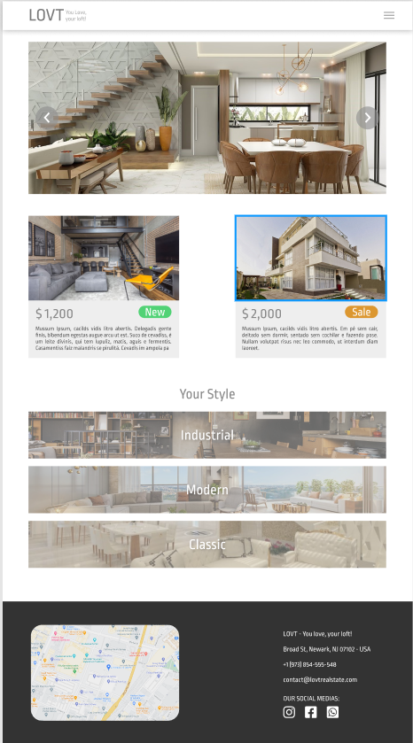

# Project Name

This is a solution to the **Lovt Project**. 

## Table of contents

- [Project Name](#project-name)
  - [Table of contents](#table-of-contents)
  - [Overview](#overview)
    - [The challenge](#the-challenge)
    - [Objectives:](#objectives)
  - [How to install or execute this project](#how-to-install-or-execute-this-project)
    - [Prerequisites](#prerequisites)
    - [Run the project](#run-the-project)
  - [My process](#my-process)
    - [What I learned](#what-i-learned)
  - [Useful resources](#useful-resources)
  - [Author](#author)

<br>

## Overview
<br>

### The challenge

Create the front-end of the provided layout using <code>html</code>, <code>css</code> and all the content learned in the training. 
> *Criar o front-end do layout fornecido utilizando html, css e todos os conteúdos aprendidos no treinamento.*

<br>



<br>

### Objectives:

- [ ] Should be a mobile-first;
- [ ] Should be a tablet version;
- [ ] Should be a desktop version;
- [ ] Should be use media queries;
- [ ] Should be has a 'hamburger menu' in the mobile version;
- [ ] Should be has a menu with three links in the desktop version;

<br>

## How to install or execute this project

### Prerequisites

- [Git](https://git-scm.com)
- [Node.js](https://nodejs.org/en/)
- [NPM](https://www.npmjs.com/)
- [VSCode](https://code.visualstudio.com/) - Or use a code editor of your choice.

<br>

### Run the project
<br>

```bash
# Clone this repository
$ git clone git@github.com:danilo-batista/dhLovt.git

# Access the project folder on your computer via terminal or code editor
$ cd dhLovt

```

<br>

## My process

### What I learned

Soon...
> Em breve...

<br>

## Useful resources

1. [W3Schools](https://www.w3schools.com)
2. [MDN](https://developer.mozilla.org/pt-BR/docs/Web/HTML) 

<br>

## Author

- Github - [Danilo Batista](https://github.com/danilo-batista)
- LinkedIn - [Danilo Batista](https://www.linkedin.com/in/danilobatista/)
- Website - [Danilo Batista](https://www.danilobatista.com)
